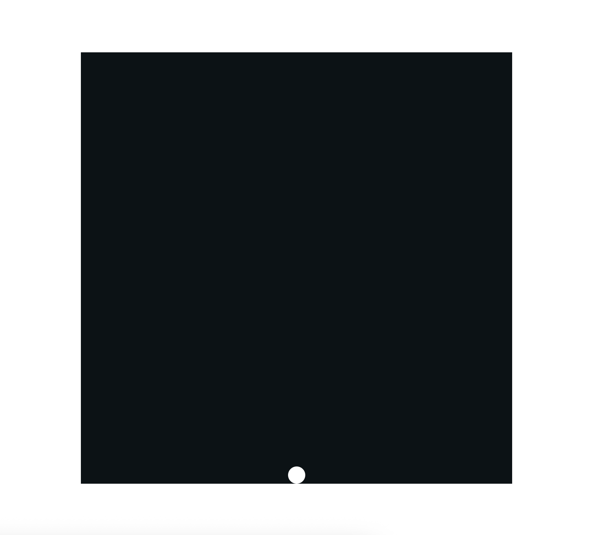

# Bouncy Ball

Your job is to create a square game area that takes up 80% of the screen and to add a ball that starts at the bottom middle of the game area and bounces around the walls.

You can choose whatever colors your like. The ball in the example solution is 4% of the game area.

You can safely let the ball bounce indefinitely.
