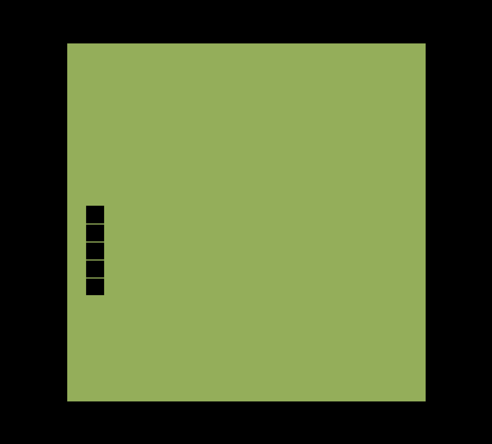

# Slithery Snake

## Instructions

Your job is to create a square game area that takes up 80% of the screen and to add a snake that moves around. For now, you should just get the snake starting in the center moving around the edges.

If you do everything correctly, you should be able to overlay your solution onto mine and it should look and work identically!

You can choose whatever colors your like. Each snake segment in my example solution is 5% of the game area, and it keeps 5% from the edge of the board.

As long as you don't keep creating unlimited elements, you can safely let the snake move indefinitely.

## Segments

The secret to solving this exercise is to think in segments. Rather than trying to move the snake element, think about how to move it's segments.

